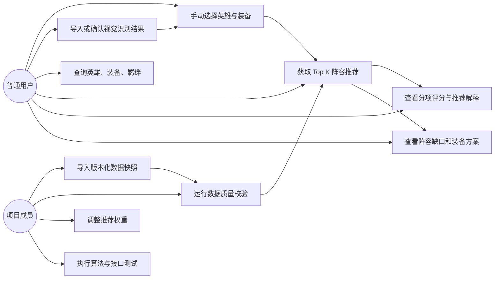
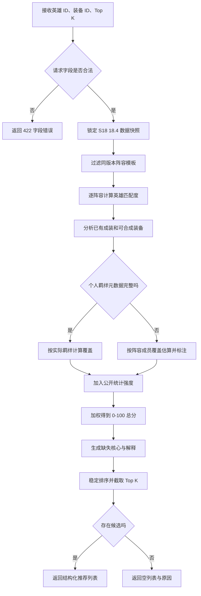
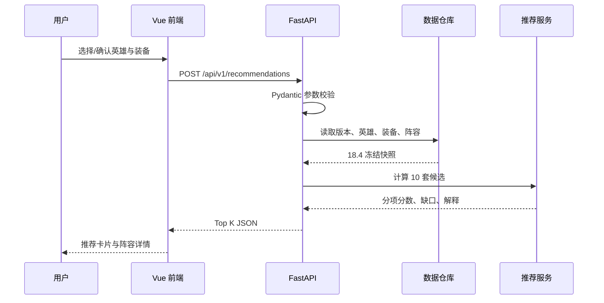

# 第二周系统设计图

## 1. 用户用例图

```mermaid
flowchart LR
    U((普通用户))
    M((项目成员))

    U --> UC1[手动选择英雄与装备]
    U --> UC2[导入或确认视觉识别结果]
    U --> UC3[查询英雄、装备、羁绊]
    U --> UC4[获取 Top K 阵容推荐]
    U --> UC5[查看分项评分与推荐解释]
    U --> UC6[查看阵容缺口和装备方案]

    M --> UC7[导入版本化数据快照]
    M --> UC8[运行数据质量校验]
    M --> UC9[调整推荐权重]
    M --> UC10[执行算法与接口测试]

    UC2 --> UC1
    UC1 --> UC4
    UC4 --> UC5
    UC4 --> UC6
    UC7 --> UC8
    UC8 --> UC4
```

## 2. 功能结构图

```mermaid
flowchart TB
    SYS[自然之力智能推荐系统]

    SYS --> DATA[数据管理]
    SYS --> INPUT[资源输入]
    SYS --> REC[AI 推荐]
    SYS --> ANALYZE[阵容分析]
    SYS --> VISION[视觉增强]
    SYS --> UI[前端展示]

    DATA --> D1[版本快照]
    DATA --> D2[英雄/羁绊]
    DATA --> D3[装备/配方]
    DATA --> D4[阵容/来源]

    INPUT --> I1[手动选择]
    INPUT --> I2[视觉结果确认]

    REC --> R1[候选生成]
    REC --> R2[分项评分]
    REC --> R3[Top K 排序]
    REC --> R4[解释生成]

    ANALYZE --> A1[缺失英雄]
    ANALYZE --> A2[可合成装备]
    ANALYZE --> A3[羁绊就绪度]
    ANALYZE --> A4[风险与调整建议]

    VISION --> V1[窗口捕获]
    VISION --> V2[区域裁剪]
    VISION --> V3[图标识别]
    VISION --> V4[置信度与人工纠错]

    UI --> P1[数据浏览]
    UI --> P2[资源选择]
    UI --> P3[推荐列表]
    UI --> P4[阵容详情]
```

## 3. 推荐流程图

```mermaid
flowchart TD
    A[接收英雄 ID、装备 ID、Top K] --> B{请求字段是否合法}
    B -- 否 --> X[返回 422 字段错误]
    B -- 是 --> C[锁定 S18 18.4 数据快照]
    C --> D[过滤同版本阵容模板]
    D --> E[逐阵容计算英雄匹配度]
    E --> F[分析已有成装和可合成装备]
    F --> G{个人羁绊元数据完整吗}
    G -- 是 --> H[按实际羁绊计算覆盖]
    G -- 否 --> I[按阵容成员覆盖估算并标注]
    H --> J[加入公开统计强度]
    I --> J
    J --> K[加权得到 0-100 总分]
    K --> L[生成缺失核心与解释]
    L --> M[稳定排序并截取 Top K]
    M --> N{存在候选吗}
    N -- 是 --> O[返回结构化推荐列表]
    N -- 否 --> P[返回空列表与原因]
```

## 4. 输入到结果的数据追踪

```mermaid
sequenceDiagram
    participant User as 用户
    participant Web as Vue 前端
    participant API as FastAPI
    participant Repo as 数据仓库
    participant Ranker as 推荐服务

    User->>Web: 选择/确认英雄与装备
    Web->>API: POST /api/v1/recommendations
    API->>API: Pydantic 参数校验
    API->>Repo: 读取版本、英雄、装备、阵容
    Repo-->>API: 18.4 冻结快照
    API->>Ranker: 计算 10 套候选
    Ranker-->>API: 分项分数、缺口、解释
    API-->>Web: Top K JSON
    Web-->>User: 推荐卡片与阵容详情
```

上述链路中，每个阵容保留 `source_url`、`collected_at` 和 `sample_count`，可从推荐结果追溯到冻结数据及公开来源。
